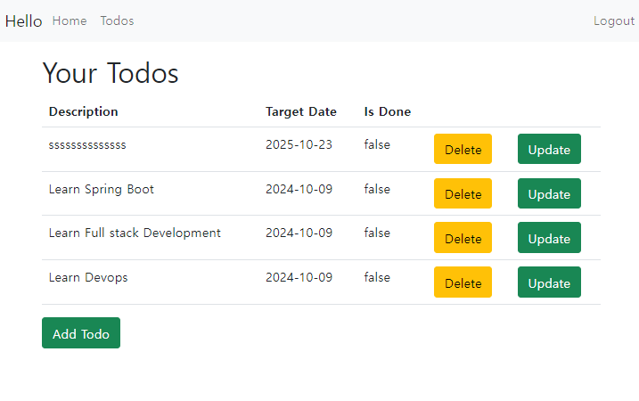
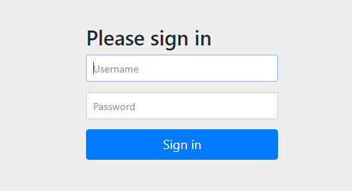
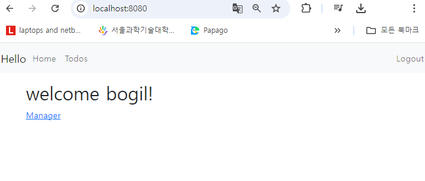
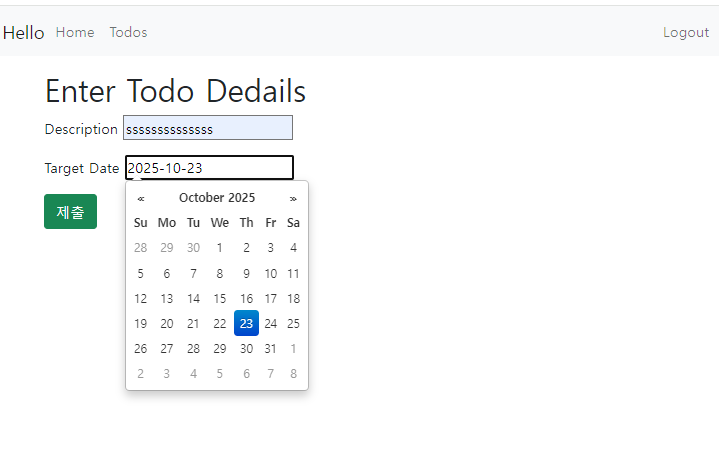

# ToDo List Management Application

 <!-- 여기에 프로젝트 로고 이미지 URL을 넣으세요 -->

## 소개

이 프로젝트는 Spring Boot를 사용하여 만든 간단한 To-Do 리스트 관리 애플리케이션입니다. 사용자는 로그인 후 할 일을 추가, 수정, 삭제할 수 있으며, H2 데이터베이스와 JPA를 사용하여 데이터를 저장합니다. JSP를 사용하여 사용자 인터페이스를 구현했습니다.

## 기술 스택

- **프레임워크**: Spring Boot
- **데이터베이스**: H2
- **ORM**: JPA (Java Persistence API)
- **템플릿 엔진**: JSP
- **보안**: Spring Security

## 기능

- 사용자 등록 및 로그인 기능
- To-Do 리스트 CRUD(Create, Read, Update, Delete) 기능
- 할 일 추가, 수정 및 삭제
- 사용자 인터페이스 제공

## 이미지

 <!-- 여기에 To-Do 리스트 사용자 인터페이스 이미지를 넣으세요 -->
 <!-- 여기에 To-Do 리스트 사용자 인터페이스 이미지를 넣으세요 -->
 <!-- 여기에 To-Do 리스트 사용자 인터페이스 이미지를 넣으세요 -->

## 라이선스

이 프로젝트는 MIT 라이선스를 따릅니다. [LICENSE](LICENSE) 
